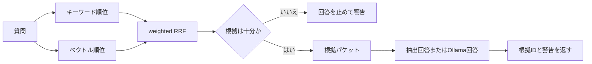

# Vidarabine Hybrid RAG — Public Portfolio Edition

ビダラビンを題材に行ったローカルRAG実習について、**公開可能な設計・コード・評価方法だけ**を再構成したポートフォリオです。キーワード検索とベクトル検索の順位を weighted Reciprocal Rank Fusion（RRF）で統合し、根拠が足りない質問を回答生成前に止める流れを確認できます。

> [!IMPORTANT]
> このリポジトリにビダラビンの実際の医薬品本文は含まれません。付属コーパスは、検索プログラムを安全に試すために作成した架空の合成データです。医療判断、服薬判断、診療、調剤には使用できません。

## できること

- 日本語・英数字を対象にしたキーワード検索
- 依存パッケージ不要のハッシュ型ベクトル検索
- weighted RRFによるハイブリッド順位統合
- 根拠不足、最新性、個別患者相談の警告
- 根拠IDを伴う抽出的なデモ回答
- 任意でローカルOllamaの埋め込み・回答モデルを利用
- JSONL評価セットによるHit判定とGitHub Actionsでの自動検査

## まず試す

必要なのはPython 3.11以降です。通常のデモには外部パッケージもネット接続も不要です。

```powershell
python .\src\vidarabine_rag.py search "デモ注射剤Vと仮想薬Aの組合せについて教えて"
python .\src\vidarabine_rag.py answer "仮想成分Vのデモ製品にはどんな剤形がある？"
python .\src\vidarabine_rag.py inspect
python .\src\vidarabine_rag.py evaluate
python .\scripts\verify_portfolio.py
```

またはWindows PowerShellで次を実行します。

```powershell
.\scripts\run_demo.ps1
```

評価が成功すると、`all_tests_passed: true` と表示されます。

## 構成

```text
config/                 検索・Ollama設定
data/sample/            著者作成の合成コーパスと評価質問
docs/                   設計、公開範囲、再現手順
results/                元実習の集計値と公開デモの検証記録
scripts/                実行、整合性検証、manifest生成
src/                    公開用RAGコード
tests/                  単体テスト
.github/workflows/      GitHub Actions
```

## 検索フロー



設計の詳細は [docs/ARCHITECTURE.md](docs/ARCHITECTURE.md) を参照してください。

## 任意：Ollamaを使う

Ollama側で設定ファイル記載のモデルを準備したあと、`config/portfolio_config.json` の `retrieval.vector_backend` を `ollama` に変更します。回答生成も使う場合は `answer` に `--use-ollama` を付けます。

```powershell
python .\src\vidarabine_rag.py answer "仮想成分Vの対象範囲は？" --use-ollama
```

Ollamaを使わない既定モードは、機械ごとの差を減らすための軽量再現経路です。

## 自分が利用権を持つコーパスへ差し替える

公開デモは、次のファイルが存在すれば**自動的に実データを優先**します。コマンドを書き換える必要はありません。

```text
data/private/vidarabine_documents.jsonl
```

以前の実習で作成した `vidarabine_keyword_documents.jsonl` または `vidarabine_chunks.jsonl` は、項目名を自動変換して読み込めます。元ファイルを上記の名前でコピーするか、インストール用スクリプトを使います。

```powershell
.\scripts\install_private_corpus.ps1 `
  -SourceFile "D:\private-rag-data\vidarabine_keyword_documents.jsonl"
```

配置後は、本文を表示しない検査で切り替えを確認できます。

```powershell
python .\src\vidarabine_rag.py inspect
```

`corpus_path` が `data/private/vidarabine_documents.jsonl`、`status` が `ready` なら準備完了です。その後は合成デモと同じコマンドで検索できます。

```powershell
python .\src\vidarabine_rag.py answer "ビダラビンについて質問"
```

`data/private/` はGitの対象外です。実データを置いたあとも、GitHubへ送るのはコードと合成サンプルだけです。詳しい手順は [data/PRIVATE_CORPUS_GUIDE.md](data/PRIVATE_CORPUS_GUIDE.md) にあります。

実データ配置後に公開ZIPを作り直す場合は、`data/private`を除外する専用の `.\scripts\build_public_zip.ps1` を使用します。

新しくJSONLを作る場合は、`data/sample/synthetic_documents.jsonl` と同じ構造も使用できます。

次のキーを持つ文書を1行1件で用意します。

| キー | 必須 | 内容 |
|---|---|---|
| `id` | はい | 一意の根拠ID |
| `text` | はい | 検索対象本文 |
| `title` | 推奨 | 文書名 |
| `section` | 推奨 | 項目名 |
| `keywords` | 推奨 | 検索補助語の配列 |
| `synthetic` | 推奨 | 合成データなら `true` |
| `source_label` | 推奨 | 出典・利用条件の短い記録 |

別の場所に置く場合は、従来どおり `--corpus` で直接指定できます。

```powershell
python .\src\vidarabine_rag.py --corpus D:\private-rag-data\licensed_documents.jsonl search "質問"
```

医薬品資料を使う場合は、公開前に著作権、契約、個人情報、再配布条件を確認してください。このリポジトリへ実データを追加することは推奨しません。

## 公開範囲

元実習で使用した書籍・CD由来の本文、そこから作成したチャンク、埋め込み、回答ログ、ローカルパス、バックアップは含めていません。公開版の境界は [DATA_AVAILABILITY.md](DATA_AVAILABILITY.md) に記録しています。

元実習の評価集計は [results/ORIGINAL_PRIVATE_EVALUATION_SUMMARY.md](results/ORIGINAL_PRIVATE_EVALUATION_SUMMARY.md) にあります。ただし、その値は非公開コーパスで得た過去の実行記録であり、この公開サンプルだけから再計算できる値ではありません。

## 検証

GitHub Actionsとローカル検証は、次を確認します。

- Python構文と単体テスト
- JSON / JSONLの読み込み
- 合成評価セット 5/5 合格
- 個人PCの絶対パス、一般的な秘密情報パターン、禁止ファイル拡張子の不在
- `MANIFEST.sha256` と配布ファイルの一致

検証の意味と限界は [docs/REPRODUCIBILITY.md](docs/REPRODUCIBILITY.md) を参照してください。

## AI利用の透明性

設計整理、公開用コード、文書化、検査にはAI支援を利用しました。ユーザーとAIの分担、検証範囲、限界は [AI_ASSISTANCE.md](AI_ASSISTANCE.md) と [AI_REPRODUCIBILITY_REVIEW.md](AI_REPRODUCIBILITY_REVIEW.md) に記録しています。

## ライセンス

このリポジトリは閲覧用ポートフォリオです。再利用・変更・再配布を許諾するオープンソースライセンスは付与していません。詳細は [LICENSE.md](LICENSE.md) を確認してください。第三者ソフトウェアについては [THIRD_PARTY_NOTICES.md](THIRD_PARTY_NOTICES.md) を参照してください。

## 免責

本成果物は学習・技術ポートフォリオであり、医療機器、診断支援、処方支援、最新の添付文書検索サービスではありません。出力の正確性、完全性、最新性は保証されません。
